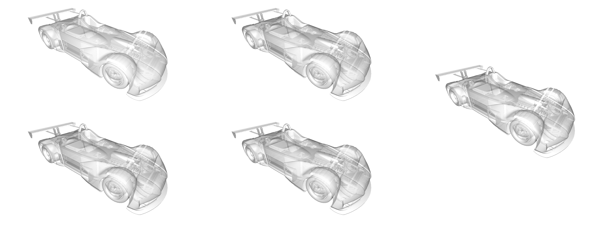
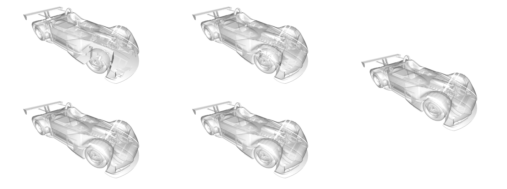
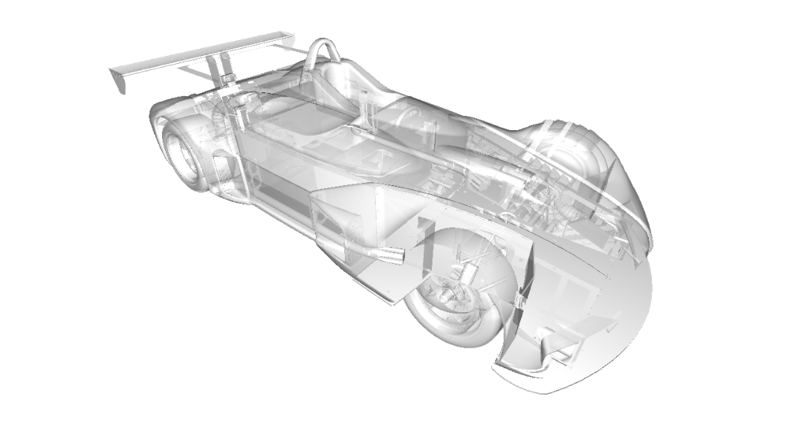
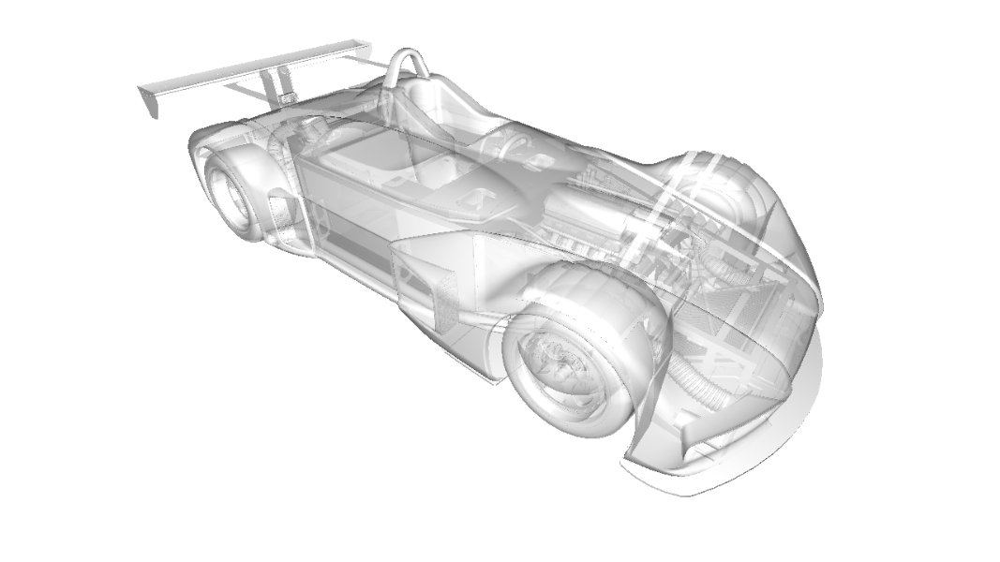
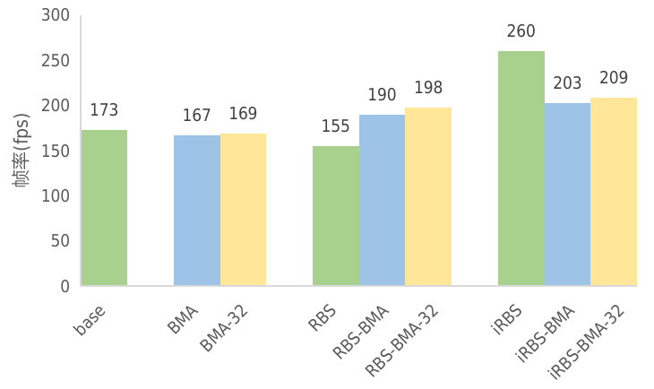

# OIT 渲染框架实验报告

## 概述

本项目是一个基于 Vulkan 的顺序无关透明度（Order-Independent Transparency, OIT）渲染框架，也是作者本科毕业设计《CAD模型的顺序无关透明度渲染研究》的核心工作。目标是：在统一的 Vulkan 框架下公平对比多种经典 OIT 算法的画质与性能，并针对 Linked List 算法实现三种加速方法（BMA / RBS / iRBS），结合 Nsight Graphics 分析性能瓶颈与优化原理。

## 实验环境

| 项目 | 配置 |
| --- | --- |
| CPU | AMD Ryzen 9 7940H |
| 内存 | 64 GB |
| GPU | NVIDIA RTX 4060 Laptop |
| 渲染分辨率 | 1280 × 720 |
| 渲染 API | Vulkan（本仓库自研框架） |
| 性能分析工具 | NVIDIA Nsight Graphics（GPU Trace Profiler） |

所有实验均在同一模型、同一视角下进行，保证算法间公平对比。

**复现方式：**

- 性能数据：示例程序支持基准测试模式（见根目录 README 的命令行参数），如 `-b/--benchmark` 开启 benchmark，`-br` 设置时长、`-bw` 设置预热时间、`-bt` 导出逐帧时间、`-bf` 指定结果文件，可输出 CSV 供统计 FPS。
- 画质数据：程序内 ImGui 界面提供 "export picture" 按钮，可将当前渲染结果导出为 PNG（`exported_image.png`），用于与参考图像计算 SSIM（结构相似性指数）。
- 算法与参数可在运行时通过 ImGui 切换（着色器经 shaderc 运行时重编译，无需重启程序）。

## 算法概览

本仓库实现并可复现的算法：

- **Linked List**（基于 GPU 原子操作的 A-buffer）及其 6 种优化变体：
  `base`、`BMA`（Backwards Memory Allocation）、`RBS_BMA`、`iRBS_BMA`、`RBS_only`、`iRBS_only`
  - 排序在 fragment shader 内完成，可选冒泡排序 / 双调排序（bitonic sort，可完全展开）
  - 片元上限由 `MAX_FRAGMENT_COUNT` 控制（1–128，运行时重编译切换）
- **Atomic Loop**（FreePipe 风格的单通道原子排序算法）
  - 保留层数由 `OIT_LAYERS` 控制（1–32）

> 论文中还评估了 Depth Peeling、Stochastic Transparency、Weighted Blend 等算法（仅作理论与画质分析），但这些算法未在本仓库中实现，本报告不展开。

## 实验一：经典 OIT 算法画质与性能对比

以复杂车模型同一视角为例，采用 128 层 Linked List 的渲染结果作为参考图像，分别测试不同保留层数下 Atomic Loop 与 Linked List 的渲染质量（SSIM，保留四位小数）：

| 层数 | Atomic Loop SSIM | Linked List SSIM |
| ---: | ---: | ---: |
| 2 | 0.9823 | – |
| 4 | 0.9959 | – |
| 8 | 0.9970 | 0.9530 |
| 16 | 0.9970 | 0.9850 |
| 32 | – | 0.9995 |
| 64 | – | 1.0000 |

帧率与画质综合对比：

| 层数 | Linked List FPS | Atomic Loop FPS | Linked List SSIM | Atomic Loop SSIM |
| ---: | ---: | ---: | ---: | ---: |
| 1 | 372 | 260 | – | – |
| 2 | 367 | 253 | – | 0.9823 |
| 4 | 358 | 233 | – | 0.9959 |
| 8 | 329 | 207 | 0.9530 | 0.9970 |
| 16 | 268 | 140 | 0.9850 | 0.9970 |
| 32 | 202 | 122 | 0.9995 | – |
| 64 | 174 | – | 1.0000 | – |
| 128 | 173 | – | – | – |

对比渲染图（左：不同层数；右：128 层 Linked List 参考图像）：

参考图像与部分层数结果：

**结论：**

- 相同层数下 Linked List 帧率明显更高（性能下降平缓），而 Atomic Loop 随层数增加性能下降显著。
- Atomic Loop 保证保留的是最近的几层片元，约 4 层即可达到 SSIM > 0.99（4 层：233 FPS / 0.9959）；Linked List 因建表阶段不排序，需要约 32 层才能达到同等画质（32 层：202 FPS / 0.9995）。
- 选型建议：画质要求高、帧率要求低的场景选 Atomic Loop；帧率优先的场景选 Linked List。
- Nsight Graphics 显示，两者最严重停顿均为 Long Scoreboard（等待显存/L2 数据依赖），瓶颈都在内存子系统。

## 实验二：Linked List 加速（BMA / RBS / iRBS）

在 128 层 Linked List 上对比三种加速方法。整体帧率对比如图：

（base = 朴素 Linked List；*BMA 各渲染通道链表长度为 128/32/16/8/4；*BMA-32 为 128/32；RBS-BMA\* 和 iRBS-BMA\* 只在链表长度 128 的通道分块排序；iRBS 使用双调排序。）

**BMA（Backwards Memory Allocation）**：按像素链表长度分档绑定不同着色器，按需分配局部数组，提升可同时活动的 warps 数。

| 指标 | base | BMA |
| --- | ---: | ---: |
| Pixel Shader Warps | 26.8% | 51.5% |
| Active SM Unused Warp Slots | 50.8% | 36.3% |

但 BMA 需要拆成多个渲染通道、多次 drawCall，对不连续像素的写入增大了显存写带宽压力，因此 warps 翻倍带来的实际加速并不明显：

| 方法 | 渲染通道数组长度 | VRAM Write Bandwidth | Pixel Shader Warps |
| --- | ---: | ---: | ---: |
| Base | 128 | 8.6% | 30.5% |
| BMA | 128 | 33.7% | 80.2% |
| BMA | 32 | 17.3% | 63.5% |
| BMA | 16 | 7.9% | 43.7% |
| BMA | 8 | 2.9% | 11.7% |
| BMA | 4 | 0.1% | 0.2% |
| BMA-32 | 128 | 31.7% | 69.1% |
| BMA-32 | 32 | 14.1% | 51.2% |

**RBS（Register Block Based Sort）**：分块到定长小数组上排序（编译期常量索引 → 更可能进寄存器），再归并。

| 指标 | base | RBS | RBS-noCopy |
| --- | ---: | ---: | ---: |
| Time（排序混合通道，ms） | 3.80 | 4.24 | 3.78 |
| Live Registers（排序阶段） | 24 | 44 | 27 |
| Pixel Shader Warps | 30.5% | 73.6% | 85.5% |
| L1TEX Hit Rate | 60.7% | 15.7% | 46.4% |

RBS 活跃寄存器数量确实提升（24 → 44），但频繁的数组拷贝破坏数据局部性，L1 命中率从 60.7% 掉到 15.7%，单用反而变慢（3.80ms → 4.24ms）；需与 BMA 结合（仅链表长度 > 32 的通道使用 RBS）才有明显收益。

**iRBS（improved RBS）**：在 RBS 基础上将排序完全展开为串行双调排序网络，优化指令流。

| 指标 | RBS | RBS-unroll | iRBS |
| --- | ---: | ---: | ---: |
| Time（排序混合通道，ms） | 4.24 | 1.75 | 1.39 |
| SM Throughput | 33.4% | 80.7% | 53.8% |
| L1TEX Hit Rate | 15.7% | 40.6% | 45.8% |
| Stalled on Long Scoreboard | 60.8% | 7.2% | 9.9% |

Nsight 分析的关键发现：性能提升的主因**不是**文献所述的"代码更短、指令缓存更友好"（加入 `#pragma optionNV(inline all)` 完全展开后性能无显著变化），而是**展开排序消除了控制流、优化了指令流**——SM 吞吐量提升、L1 命中率回升、Long Scoreboard 停顿从 60.8% 降至 9.9%。双调排序优于展开冒泡排序则得益于更优的时间复杂度 O(n log² n) vs O(n²)，且无需递归调用，适合在着色器中实现。

## 结论

在三种加速方法中，iRBS 效果最显著：**排序混合渲染通道耗时从 4.24ms 降至 1.39ms，整体帧率从 173 FPS 提升至 260 FPS**。BMA 通过优化内存分配提升活跃 warps 但受多通道写入开销限制；RBS 提升寄存器利用率但需与 BMA 结合才能抵消拷贝开销；iRBS 通过指令流优化同时改善了计算吞吐与缓存行为。本框架支持运行时切换上述全部算法与参数，可作为快速评估 OIT 算法在特定设备上画质/性能表现的实用工具。
